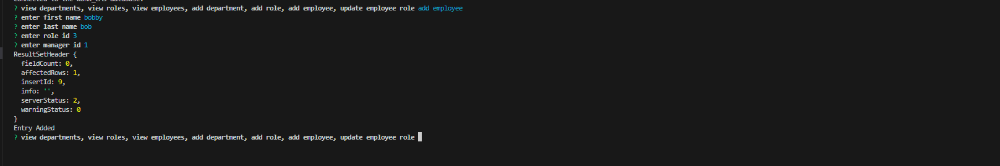

# Work-CMS

  

   
  

  ## Description
  This Application allows you to view your business database, to view specific information like departments , employees and roles. Select the option you would like to implement and the command will be executed on your request.
  

   

## License
  
    Copyright 2023 Andy316C Licensed under the Apache License, Version 2.0 (the 'License'); you may not use this file except in compliance with the License. You may obtain a copy of the License at http://www.apache.org/licenses/LICENSE-2.0 Unless required by applicable law or agreed to in writing, software distributed under the License is distributed on an 'AS IS' BASIS, WITHOUT WARRANTIES OR CONDITIONS OF ANY KIND, either express or implied. See the License for the specific language governing permissions and limitations under the License.

   
  
  ## Table of contents
  <ol>
  <li><a href='#title'>Title</a></li>
  <li><a href='#desc'>Description</a></li>
  <li><a href='#install'>Installation</a></li>
  <li><a href='#cont'>Contribution</a></li>
  <li><a href='#test'>Testing</a></li>
  <li><a href='#images'>Images</a></li>
  <li><a href='#questions'>Questions</a></li>
  <li><a href='#contact'>Contact Info</a></li>
  </ol>
   

  

  ## Installation
  The application required multiple npm packages for successfull deployment, the pacakages required were Inquirer@8.2.4 for the command requests, express to send/receive the request and mysql2 to connect to the database of your business

  

   

  

  ## Contribution Guidelines
  Updates to department, roles and employee information only
  

   

  

  ## Testing
  enter the starting command of node server.js to connect to your database. then select any of the 7 options avalible by entering what you would like to achieve.
  the opyions are listed in the command line but are as follow.  
  1: View departments table  
  2: view roles table  
  3: view employees table  
  4: add department  
  5: add role  
  6: add employee 
  7: update employee role  

 
  

   
   

  ## Images
  Starting point, this is the first input query you will be asked. a message will appear if you successfully connected to the database. "Connected to WORK_CMS database"
  
   

  Viewing requests, returned sql queries will be displayed like below
  
   
  
  Updating requests, will return the success data. and will return a "Entry Added" if the entry was successfull
  
   
  
  

   
  
  

  
  ## Questions
  
  For questions or information please Email the following email address with your questions or concerns.
   

  Company Name: 
  Global Software CMS INC
   

  Company Email:  
  GlobalSoftwareCMSINC@gmail.com
  

   

  
  ## Contact Info
  Developers Name:  
  Andrew Clark
   

  Developers Email:  
  andy@gmail.com

  

  
